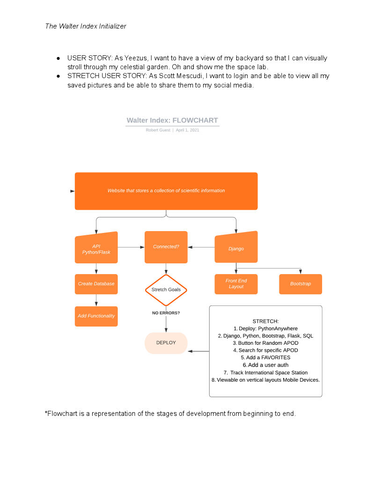
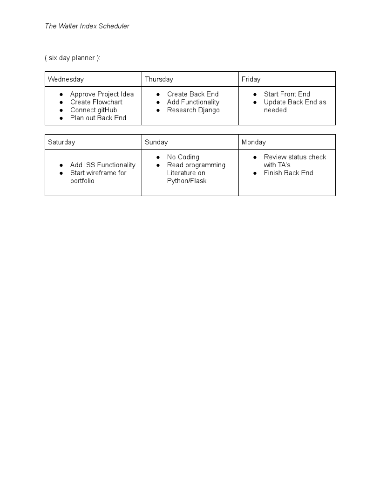

```
PROJECT 4 (SOLO): General Assembly Software Engineering Immersive 1-19
```
## Walter Index
The idea behind this project is to recreate a web based tool in the interest of Astronomy and general Science. This tool will enable user's to view information, add image to their favorite list, and login and signup. 

## Usage
We make the NASA API request when the server is loaded and the User is brought to the index page where they are presented with a datepicker Form:

```
- User has two options to input their date: 
  1. Dropdown Calendar
  2. Text input YYYY/MM/DD
- User clicks submit
- Form submit listener activates and renders a function to return the json object.
```

- - - -

## Code Structure




- - - - 

## Authors & Sources
<details>
  <summary>Author</summary>
  <p>
    :bust_in_silhouette: Software Engineer: Robert 'rikk' Guest - email: rikkxdzn@icloud.com
  </p>
</details>
<details>
  <summary>Sources</summary>
  <p>
    :exclamation:Phil Winchester, Ben Manning, John Jacobs, Glenn Brown, Raahima Ahmed, & Ron Myers:exclamation:
  </p>
  <p>
    :exclamation:API keys provided by NASA Open API - [NASA Open API](https://api.nasa.gov)
  </p>
  <p>
    :exclamation:API keys provided by OPEN NOTIFY - [OPEN NOTIFY ORG](http://open-notify.org/)
  </p>
    :exclamation:Stack Overflow: Date Picker Widget with Flask - [solvedBy Doobeh](https://stackoverflow.com/questions/26057710/datepickerwidget-with-flask-flask-admin-and-wtforms)
  </p>
  <p>
    :exclamation:Bootstrap Docs, Jinja2 Docs, Flask Docs, 
  </p>
</details>

- - - -
