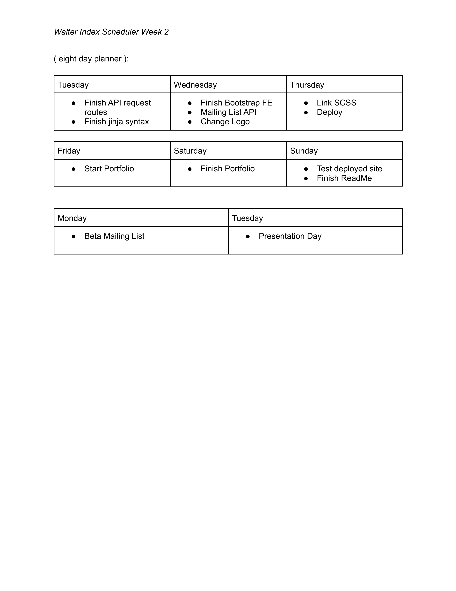

```
PROJECT 4 (SOLO): General Assembly Software Engineering Immersive 1-19
```
## Walter Index
- The idea behind this project is to recreate a web based tool in the interest of Astronomy and general Science. This search tool will enable user's to cycle through information provided for the progress of ('extra')Terrestial exploration!

## URL
[WalterIndex](http://nazkarrikk.pythonanywhere.com/)

## Usage
- Make a request to NASA's OPEN API Key and display data using the magic of Python and Bootstrap!!

## Goals
- Explore the usage of API and data visualization tools
- Refine my understanding of Python and its available supporting libraries and frameworks
- Build using a front end not previously taught

## Layout
```
- Present User with a simple layout where the user naturally can learn to manipulate website.
- Search Date is provided with two options:
  1. Dropdown Calender
  2. Manually input date
- Upon submit, a request to the API is sent and response is rendered in a JSON object, then rendered to HTML
- User has an option to register for mailing list with the MAILING link inside the navigation bar. 
```

## Code Structure



- - - - 

- - - - 
## Areas of Focus: Does it Meet Viable Product requirements?

```
- Flask, Jinja, Bootstrap 4, CSS3, HTML
- Deployed w/ Python Anywhere
- Manipulation of several API's  
- Responsive Website
- Responsive Portfolio Page 
- Clean UI
- Display knowledge of Coding ability
```

## Missed Deadlines: Future Revisions!!

```
- Decided against the Django implementation. Possible code conversion in future updates!
- Favorites and Social Media icons will be included in future updates. Db is dependent on User Traffic.
- Date validation function for start date / end date queries.
- Refactor index.html block elements
- Collaborate with Data Sci. dev member to gain insight on Data viz model rendering
```
- - - -
## Authors & Sources
<details>
  <summary>Author</summary>
  <p>
    :bust_in_silhouette: Software Engineer: Robert 'rikk' Guest
  </p>
</details>
<details>
  <summary>Sources</summary>
  <p>
    :exclamation:Phil Winchester, Ben Manning, John Jacobs, Glenn Brown, Raahima Ahmed, & Ron Myers:exclamation:
  </p>
  <p>
    :exclamation:API keys provided by NASA Open API - [NASA Open API](https://api.nasa.gov)
  </p>
  <p>
    :exclamation:API keys provided by OPEN NOTIFY - [OPEN NOTIFY ORG](http://open-notify.org/)
  </p>
  <p>
  :exclamation:Data Visualization tool provided by Leaflet - [Leaflet JS](https://leafletjs.com/)
  </p>
  <p>
  :exclamation: Mapping Tools provided by MapBox - [MapBox](https://www.mapbox.com/)
  </p>
  <p>
  :exclamation:API keys provided by Mail Jet - [Mail API](http://www.mailjet.com/)
  </p>
  <p>
  :exclamation:Logo made using Inkscape
  </p>
  <p>
    :exclamation:Stack Overflow: Date Picker Widget with Flask - [solvedBy Doobeh](https://stackoverflow.com/questions/26057710/datepickerwidget-with-flask-flask-admin-and-wtforms)
  </p>
  <p>
    :exclamation:Bootstrap Docs, Jinja Docs, Flask Docs, [YT channel] Creators: Code Jana, FrontEndFunn,  
  </p>
</details>

- - - -
