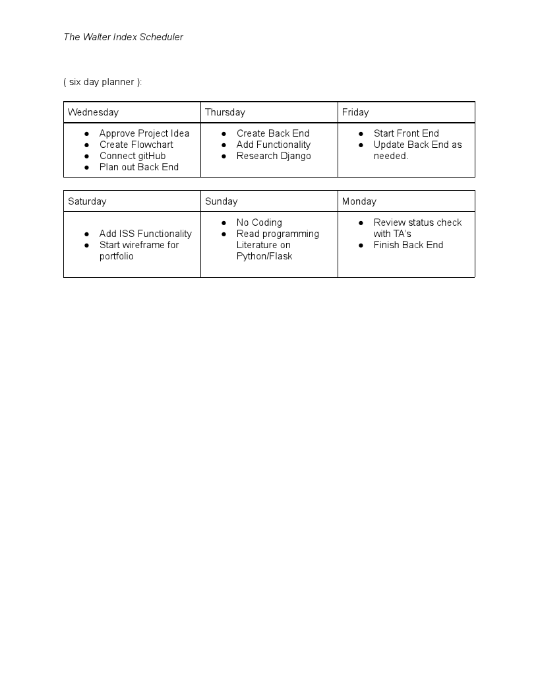

```
PROJECT 4 (SOLO): General Assembly Software Engineering Immersive 1-19
```
## Walter Index
- The idea behind this project is to recreate a web based tool in the interest of Astronomy and general Science. This search tool will enable user's to cycle through information provided for the progress of ('extra')Terrestial exploration!

## Usage
- Make a request to NASA's OPEN API Key and display data using the magic of Python and Bootstrap!!

## Goals
- Explore the usage of API and data visualization tools
- Refine my understanding of Python and its available supporting libraries and frameworks
- Build using a front end not previously taught

```
- User has two options to input their date: 
  1. Dropdown Calendar
  2. Text input YYYY/MM/DD
- User clicks submit
- Form submit listener activates and renders a function to return the json object.
- Flask receives and validates then returns the object using jinja to convert the object to a viewable html document. 
- User is greeted with a converted JSON object
```
 - - - - 
## Areas of Focus: Does it Meet Viable Product requirements?

```
- Flask, Jinja, Bootstrap 4, CSS3, HTML
- Deployed w/ Python Anywhere
- Mailing List API  
- Responsive Website
- Responsive Portfolio Page 
```

## Missed Deadlines: Future Revisions!!

```
- Date validation function for start date / end date queries.
- Refactor index.html block elements
- Collaborations with Data Sci. dev member to gain insight on Data viz model rendering
- Implementing more impactual visual tools
- Implementing brand logo into the Navigation Bar

```
- - - -

## Code Structure





- - - - 

## Authors & Sources
<details>
  <summary>Author</summary>
  <p>
    :bust_in_silhouette: Software Engineer: Robert 'rikk' Guest
  </p>
</details>
<details>
  <summary>Sources</summary>
  <p>
    :exclamation:Phil Winchester, Ben Manning, John Jacobs, Glenn Brown, Raahima Ahmed, & Ron Myers:exclamation:
  </p>
  <p>
    :exclamation:API keys provided by NASA Open API - [NASA Open API](https://api.nasa.gov)
  </p>
  <p>
    :exclamation:API keys provided by OPEN NOTIFY - [OPEN NOTIFY ORG](http://open-notify.org/)
  </p>
    :exclamation:Stack Overflow: Date Picker Widget with Flask - [solvedBy Doobeh](https://stackoverflow.com/questions/26057710/datepickerwidget-with-flask-flask-admin-and-wtforms)
  </p>
  <p>
    :exclamation:Bootstrap Docs, Jinja Docs, Flask Docs, [YT channel] Creators: Code Jana, FrontEndFunn,  
  </p>
</details>

- - - -
